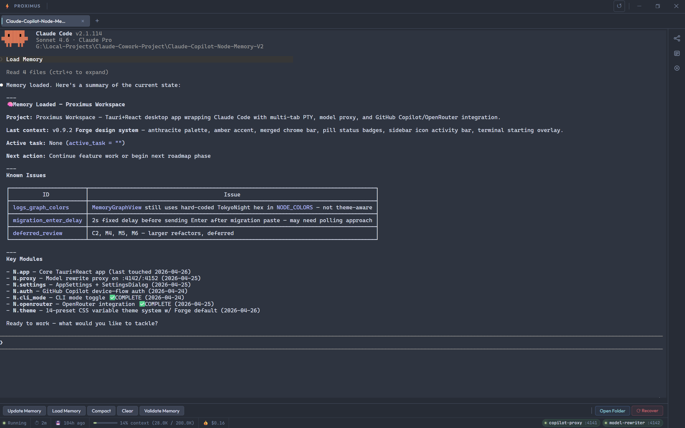
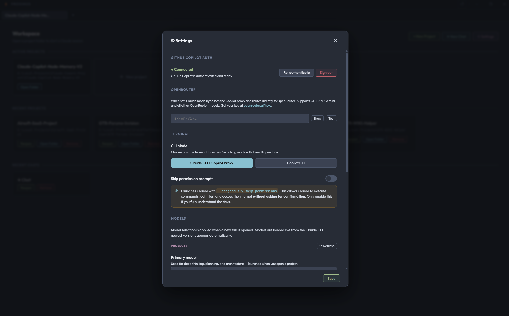
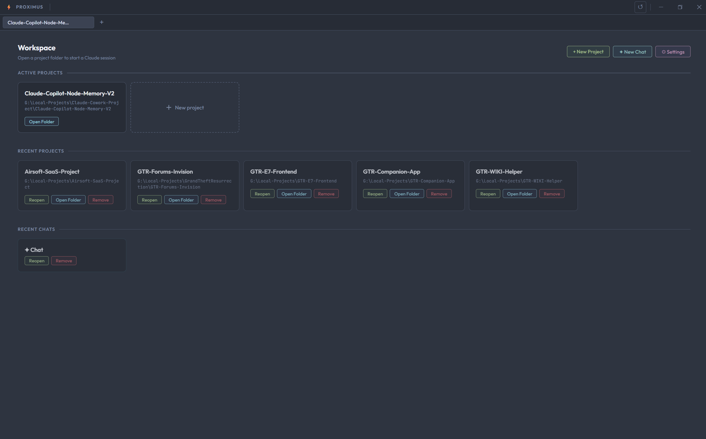

<div align="center">

# Proximus Workspace

A desktop workspace that wraps Claude Code in a native Tauri app with multi-tab terminals, a model-rewrite proxy, live memory graph visualization, and project scaffolding.

Built with **Tauri 2 · React 19 · Rust · xterm.js · Cytoscape**

[](https://docs.anthropic.com/en/docs/claude-code)
[](https://v2.tauri.app)
[](https://react.dev)
[](https://www.rust-lang.org)

> **🚧 Work in Progress** — This project is under active development. Core features are functional but expect rough edges, missing polish, and breaking changes. Contributions and feedback welcome!

</div>

---

## Who is this for?

- **Solo developers** who use Claude Code daily and want a proper workspace instead of juggling terminal windows
- **Power users** who run multiple Claude sessions at once and need tabs, context tracking, and session recovery
- **Teams exploring AI-assisted development** who want a managed environment with built-in proxy routing, structured logs, and project scaffolding
- **Anyone tired of burning through Claude API credits** — Proximus routes Claude Code through GitHub Copilot's API, so you get Claude's capabilities on Copilot's usage limits instead of draining your Anthropic quota
- **Anyone using GitHub Copilot's API** who needs a transparent model-rewrite layer without modifying their Claude setup
- **Developers building with memory systems** who want a live graph view of their project's knowledge base instead of reading raw TOML

If you've ever wished Claude Code came in an app with tabs, a sidebar, and a dashboard — that's Proximus.

---

## Screenshots

<p align="center">
  
  <br><em>Claude Code running in a full ConPTY terminal</em>
</p>

<p align="center">
  
  <br><em>Terminal with the structured logs sidebar open</em>
</p>

<p align="center">
  
  <br><em>Project launcher and scaffolding view</em>
</p>

---

## What is Proximus?

Proximus Workspace is a native desktop application that turns Claude Code into a full IDE-like experience. Instead of running Claude in a bare terminal, Proximus gives you:

- **Tabbed terminal sessions** — Run multiple Claude Code instances side by side with full ConPTY support
- **Terminal keyboard shortcuts** — Ctrl+C (copy selection), Ctrl+V (paste), Ctrl+Z (undo typing in time-grouped chunks)
- **Model rewrite proxy** — Transparently routes Claude through GitHub Copilot's API, rewriting model names on the fly
- **Live memory graph** — Visualize your project's knowledge graph in real-time with Cytoscape, click into nodes for detail
- **Project scaffolding** — Spin up new projects pre-loaded with memory systems, skills, and conventions
- **Memory migration** — Detects existing AI memory files (Cursor rules, AGENTS.md, CLAUDE.md, ADRs, etc.) and offers to migrate them into the structured .claude-memory system
- **Context tracking** — Statusline integration shows context window usage per session
- **Structured logging** — Captures backend events in a filterable sidebar panel
- **Quick actions** — One-click access to common Claude Code commands

## How the Proxy Chain Works

Proximus doesn't call the Anthropic API directly. Instead it spins up a local proxy chain on startup:

1. **copilot-api** (`:4141`) — GitHub Copilot's local API server, authenticated with your Copilot subscription
2. **model-rewrite-proxy** (`:4142`) — A lightweight Node.js HTTP proxy that intercepts requests and rewrites model names (`claude-sonnet-4-20250514` → Copilot's internal model IDs)
3. **Claude Code** connects to `:4142` thinking it's talking to Anthropic — but it's going through Copilot

This means **zero Anthropic API costs**. You use Claude Code exactly as normal, but all usage counts against your GitHub Copilot plan instead. The proxy is transparent — no config changes needed in Claude Code itself.

## How the Memory System Works

Every project scaffolded by Proximus gets a `.claude-memory/` directory — a graph-based knowledge store in plain TOML:

- **graph.toml** — Nodes (modules, plans, bugs) and edges (relationships between them), each with L0/L1/L2 summaries at increasing detail
- **state.toml** — Current task, branch, known issues — what Claude picks up when it starts a new session
- **invariants.toml** — Hard rules that never decay (e.g. "proxy must sit between Claude and copilot-api")
- **journal/** — Weekly append-only log of what changed and why
- **nodes/** — Deep detail files for each node, loaded on demand

The sidebar's **Memory Graph** view renders this live with Cytoscape — you can see your project's knowledge structure, click nodes to inspect them, and watch it update as Claude works.

## Architecture

```
┌─────────────────────────────────────────────┐
│              Proximus Workspace              │
│  ┌────────┐ ┌──────────┐ ┌───────────────┐  │
│  │ TabBar │ │ Toolbar  │ │  StatusBar    │  │
│  └────┬───┘ └────┬─────┘ └───────┬───────┘  │
│       │          │               │           │
│  ┌────▼──────────▼───────────────▼────────┐  │
│  │          Terminal (xterm.js)            │  │
│  │            ConPTY ↔ Claude Code         │  │
│  └────────────────────────────────────────┘  │
│                                              │
│  ┌─────────────┐  ┌──────────────────────┐   │
│  │  Sidebar    │  │  Quick Actions       │   │
│  │ ┌─────────┐ │  └──────────────────────┘   │
│  │ │ Memory  │ │                             │
│  │ │ Graph   │ │  ┌──────────────────────┐   │
│  │ ├─────────┤ │  │  Logs Panel          │   │
│  │ │Projects │ │  └──────────────────────┘   │
│  │ ├─────────┤ │                             │
│  │ │ Logs    │ │                             │
│  │ └─────────┘ │                             │
│  └─────────────┘                             │
└──────────────────────────────────────────────┘
         │
         │ spawns & manages
         ▼
┌──────────────────┐     ┌──────────────────┐
│  copilot-api     │────▶│ model-rewrite    │
│  :4141           │     │ proxy :4142      │
└──────────────────┘     └──────────────────┘
```

## Tech Stack

| Layer | Technology |
|-------|-----------|
| Desktop framework | Tauri 2 |
| Frontend | React 19, TypeScript, Vite 7 |
| Terminal | xterm.js 6 + ConPTY (Windows) |
| Graph visualization | Cytoscape.js |
| Backend | Rust 2021 (tokio, portable-pty, notify, serde) |
| Proxy | Node.js HTTP proxy |
| Memory | TOML-based graph (custom format) |

## Project Structure

```
├── src/                        # React frontend
│   ├── App.tsx                 # Root layout — toolbar + sidebar + terminal
│   ├── components/
│   │   ├── Terminal.tsx        # xterm.js terminal with ConPTY bridge
│   │   ├── TabBar.tsx          # Multi-tab session management
│   │   ├── Toolbar.tsx         # Top toolbar controls
│   │   ├── Sidebar.tsx         # Collapsible sidebar container
│   │   ├── MemoryGraphView.tsx # Live Cytoscape graph visualization
│   │   ├── NodeDetail.tsx      # Graph node inspector panel
│   │   ├── ProjectsView.tsx    # Project launcher / scaffolding UI
│   │   ├── MigrationDialog.tsx # Memory migration popup (detect & convert existing AI memory)
│   │   ├── LogsPanel.tsx       # Filtered structured log viewer
│   │   ├── QuickActions.tsx    # One-click Claude Code commands
│   │   ├── StatusBar.tsx       # Bottom bar — context stats + process info
│   │   └── StatusBadge.tsx     # Session state indicator
│   └── hooks/
│       ├── useMemoryGraph.ts   # Fetches & watches graph.toml / state.toml
│       └── useProcessStatus.ts # Polls process health (proxy, copilot-api)
│
├── src-tauri/src/              # Rust backend
│   ├── lib.rs                  # Tauri command registration (11 commands)
│   ├── process_manager.rs      # copilot-api + model-rewrite-proxy lifecycle
│   ├── pty.rs                  # ConPTY spawn, I/O piping, resize
│   ├── memory.rs               # TOML graph parser + file watcher
│   ├── tab_store.rs            # Tab state persistence across sessions
│   ├── scaffold.rs             # Embedded project template extraction + memory detection
│   └── logging.rs              # Circular log buffer (500 entries)
│
├── assets/screenshots/         # App screenshots
├── public/                     # Static assets
├── dev.bat                     # Dev mode launcher
├── build.bat                   # Production build script
├── vite.config.ts              # Vite configuration
└── package.json                # Frontend dependencies
```

## Prerequisites

- **Windows 10/11** — ConPTY is required for terminal emulation
- **Node.js 18+**
- **Rust toolchain** with MSVC build tools (`vcvarsall.bat x64`)
- **GitHub Copilot** access for the proxy chain

## Getting Started

```bash
# Clone the repo
git clone https://github.com/<your-username>/Proximus.git
cd Proximus/app

# Install frontend dependencies
npm install

# Run in dev mode (hot-reload frontend + Rust backend)
npm run tauri dev

# Or use the helper script
.\dev.bat

# Build production binary
npm run tauri build

# Or use the helper script
.\build.bat
```

## Key Tauri Commands

| Command | Description |
|---------|------------|
| `spawn_pty` | Start a new Claude Code terminal session |
| `write_pty` / `resize_pty` | Terminal I/O and resize |
| `start_processes` / `stop_processes` | Manage proxy chain lifecycle |
| `get_memory_graph` / `get_memory_state` | Read `.claude-memory/` TOML files |
| `scaffold_project` | Extract project template to a new directory |
| `get_log_entries` | Retrieve structured log buffer |
| `get_statusline_stats` | Context window usage from statusline |

## Terminal Shortcuts

| Shortcut | Action |
|----------|--------|
| `Ctrl+C` | Copy selected text (passes SIGINT when no selection) |
| `Ctrl+V` | Paste from clipboard |
| `Ctrl+Z` | Undo last typing chunk (keystrokes grouped by 600ms pauses; paste undoes as one block) |

## Roadmap

- [x] **Phase 1** — Core shell: Tauri app, PTY terminal, process management, proxy chain
- [x] **Phase 2** — Memory & UI: Live graph visualization, sidebar panels, logs, scaffolding
- [x] **Phase 3** — Multi-agent workspace: Parallel Claude sessions

## Known Issues

| Issue | Status |
|-------|--------|
| Claude Code ASCII animation pollutes xterm scrollback | Open |
| Status badge doesn't reflect actual PTY state | Open |
| Small black bar between terminal and quick actions (xterm row snapping) | Won't fix |

## Patch Notes

### v0.3 — Memory Migration (2026-04-19)

**New Features**
- **Memory Migration Dialog** — When adding a project with existing AI memory/context files (`.cursorrules`, `CLAUDE.md`, `AGENTS.md`, `.ai/`, ADRs, etc.) but no `.claude-memory/`, a dialog offers three choices:
  - **Migrate** — Scaffolds `.claude-memory/` and sends existing file contents to Claude for LLM-driven conversion into the structured TOML graph
  - **Start Fresh** — Scaffolds a blank `.claude-memory/` ignoring existing files
  - **Skip** — No memory system created
- Detection is smart: only triggers on files with >10 lines (ignores empty stubs) and skips projects that already have `.claude-memory/` or have no AI memory at all

**Backend**
- New Tauri commands: `detect_project_memory`, `scaffold_project_cmd`, `get_migration_file_contents`
- `create_tab` now defers scaffolding when existing memory is detected

### v0.2 — Terminal Input Overhaul (2026-04-19)

**New Features**
- **Ctrl+Z Undo** — Erases typing in time-grouped chunks (600ms grouping window). Each Ctrl+Z removes an entire burst of keystrokes. Pasted text always undoes as one block.
- **Terminal Shortcuts table** added to README

**Bug Fixes**
- **Fixed double-paste on Ctrl+V** — Browser paste event was firing alongside the custom clipboard handler, causing text to appear twice. Fixed with `event.preventDefault()` on the keydown event.

**Previous (v0.1)**
- Initial release: Tauri app, multi-tab PTY terminals, model-rewrite proxy chain, live memory graph, project scaffolding, context tracking, structured logging, quick actions, session recovery, Ctrl+C/V clipboard support, open-folder button on tabs

## License

[MIT + Commons Clause](../LICENSE) — Free to use, modify, and integrate commercially. Cannot be resold as a standalone product or service.

---

<div align="center">
<sub>Built with coffee and Claude</sub>
</div>
